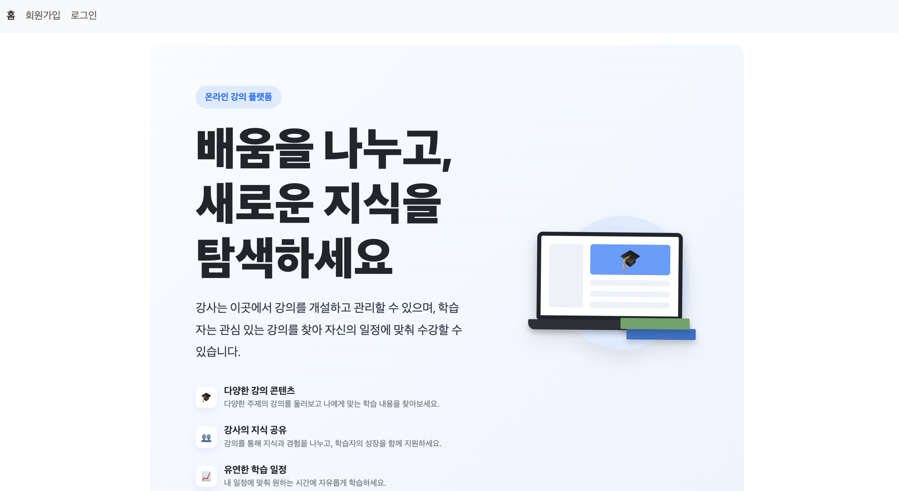
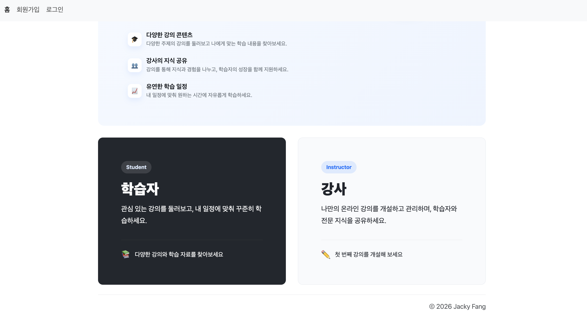
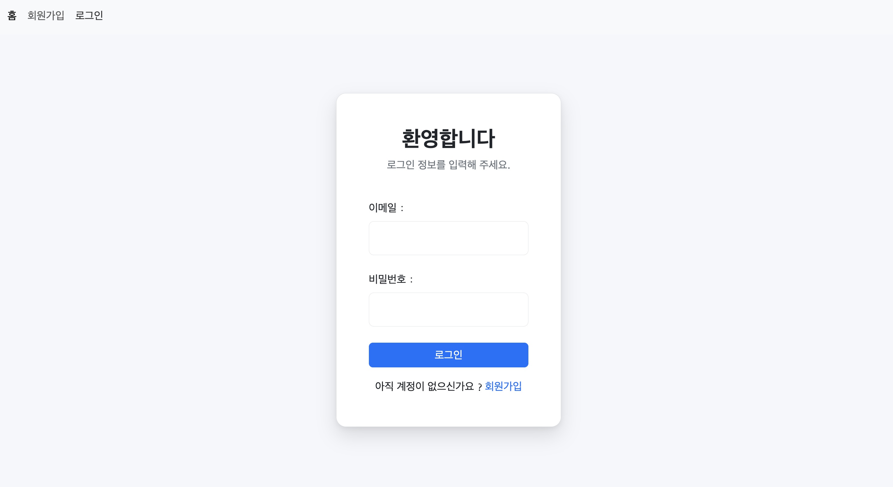
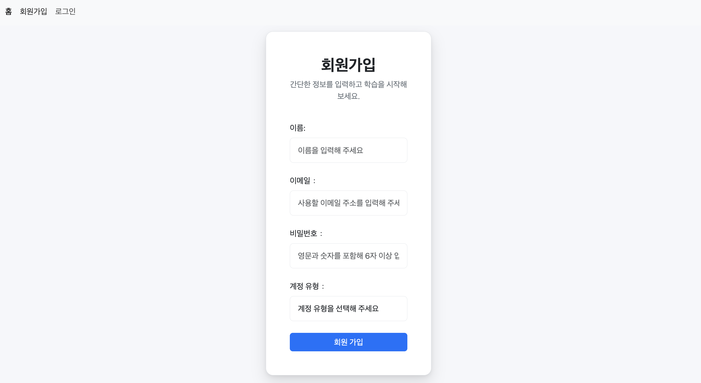
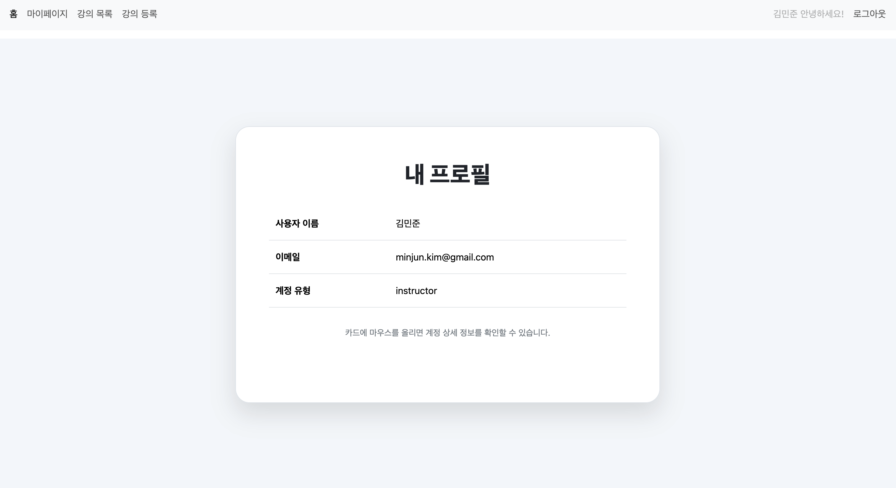
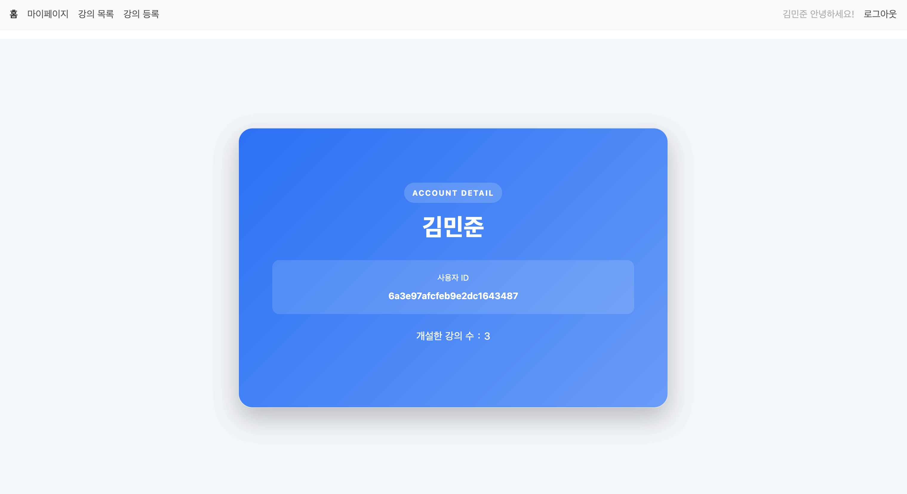
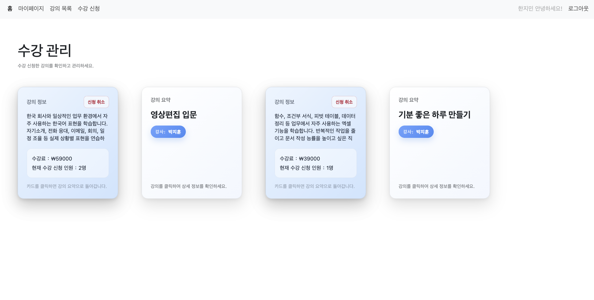
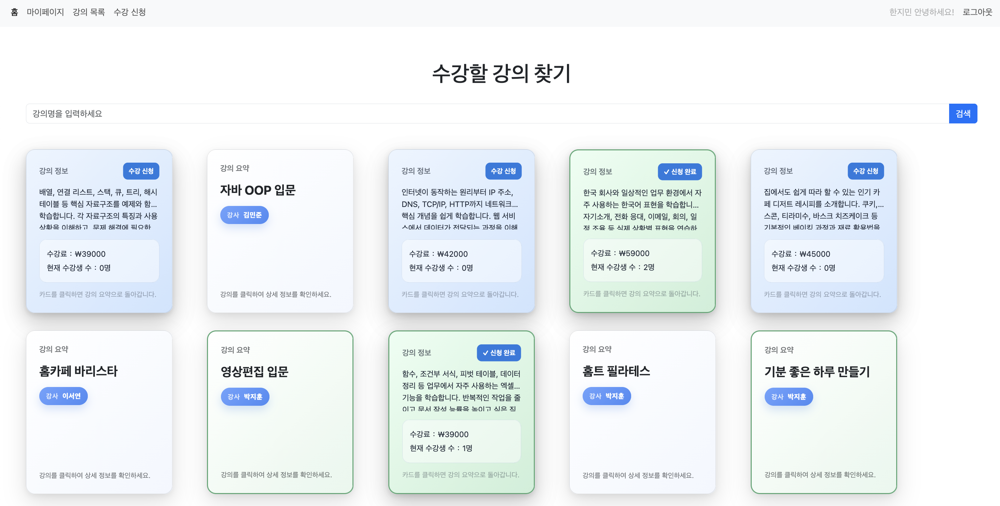
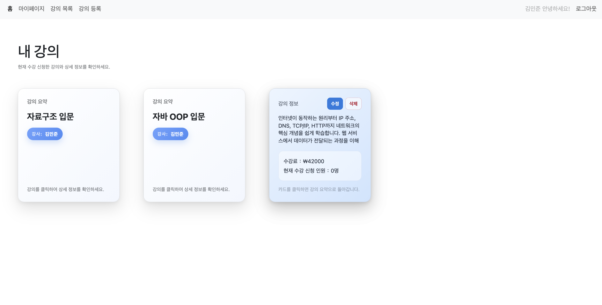
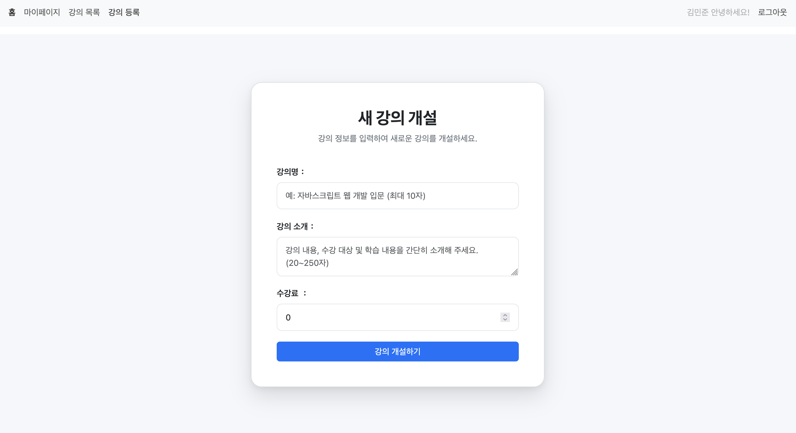

# 🎓 온라인 강의 관리 플랫폼

## [웹사이트 바로가기](https://jackyfang-course-platform-a05d06b8d172.herokuapp.com/)

## 소개

본 프로젝트는 MERN Stack을 기반으로 개발한 온라인 강의 관리 플랫폼입니다. 학생과 강사 두 가지 사용자 역할을 구분하여, 각 역할에 맞는 기능과 이용 흐름을 제공합니다.

학생은 플랫폼에 등록된 강의를 둘러보고 키워드로 원하는 강의를 검색한 뒤 수강 신청할 수 있습니다. 또한 마이페이지에서 계정 정보와 수강 신청한 강의 목록을 확인하며 자신의 학습 현황을 관리할 수 있습니다.

강사는 새로운 강의를 등록하고 게시할 수 있으며, 자신이 개설한 강의를 수정하거나 관리할 수 있습니다. 마이페이지에서는 계정 정보와 개설한 강의 목록을 한눈에 확인할 수 있습니다.

역할 기반 권한 관리를 적용하여 학생은 강의 조회 및 수강 신청 기능을, 강사는 강의 등록 및 관리 기능을 이용할 수 있도록 구현했습니다.

본 시스템은 회원가입 및 로그인, 역할별 권한 인증, 강의 검색, 강의 등록, 수강 신청, 마이페이지 조회, 강의 관리 등 온라인 강의 플랫폼의 핵심 기능을 포함하고 있습니다.

## 기술 스택

- 백엔드:`Express.js`, `Node.js`, `JWT Authentication`, `Passport.js`, `bcrypt`, `Joi`
- 프론트엔드:`JavaScript`, `HTML`, `CSS`, `React`, `React Router DOM`, `Bootstrap`
- 데이터베이스:`MongoDB Atlas`, `Mongoose`
- 배포 플랫폼: `heroku`

## 테스트 계정

### 강사 계정

| 이메일 | 비밀번호 |
| --- | --- |
| minjun.kim@gmail.com | minjun.kim |
| seoyeon.lee@gmail.com | seoyeon.lee |
| jihoon.park@gmail.com | jihoon.park |

### 학생 계정

| 이메일 | 비밀번호 |
| --- | --- |
| yujin.choi@gmail.com | yujin.choi |
| jimin.han@gmail.com | jimin.han |

> 새로운 계정을 직접 생성하여 이용하시거나, 위의 테스트 계정으로 로그인하여 기능을 확인하실 수 있습니다.

## 화면 구성

#### 홈페이지:

#### 로그인 페이지:

#### 회원가입 페이지:

#### 마이페이지:

#### 학생 신청한 강의 페이지:

#### 학생 강의 조회 및 검색 페이지:

#### 강사 강의 관리 페이지:

#### 강사 강의 등록 페이지:

